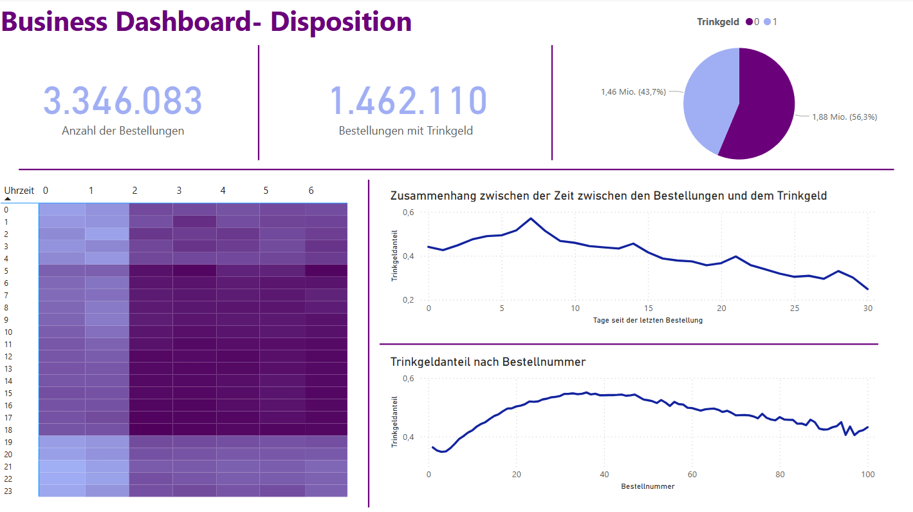

# 🛒 Instacart Market Basket Analysis

  

## 👥 Gruppe: *Instacart Insights*

- **Seniz Kurhan**  
  *(EDA für Disposition, Konkrete Fragen 1-a,b,c; 3-a,b,c)*
- ***
- ***
- ***

---

## 📌 Projektübersicht

Im Rahmen dieses Projekts führen wir eine explorative Datenanalyse für zwei zentrale Unternehmensbereiche durch:

- **📈 Marketing**
- **📦 Disposition**

Ziel ist es, auf Basis des Instacart-Datensatzes zwei **zielgruppengerechte Data Stories** aufzubereiten, um geschäftsrelevante Erkenntnisse zu gewinnen. Diese dienen als Entscheidungsgrundlage für strategische Maßnahmen in beiden Abteilungen.

---

## 🔍 3.1 Explorative Datenanalyse für Marketing und Disposition

Die Stakeholder erwarten im Jupyter Notebook einen gut strukturierten Abschnitt:

> **„EDA für Marketing und Disposition“**

---

### 🧪 Datenvorverarbeitung

Vor der Analyse erfolgen notwendige Schritte zur Datenvorbereitung:
- Verständnis der Datenstruktur
- Kombination relevanter Tabellen
- Anreicherung durch Feature Engineering

Hierbei kommen Python und gängige Libraries wie `pandas`, `matplotlib`, `seaborn`, und `scikit-learn` zum Einsatz.

---

### 🎯 Ziele der Abteilungen

#### 📊 Marketing

Die Marketingabteilung sucht nach **Kaufmuster**, um:
- Den Produktkatalog gezielt zu optimieren
- Produkte sinnvoll auf der Website zu platzieren

> **Beispiel:** Kaufen viele Kunden „Flour“ und „Eggs“ gemeinsam, könnten diese Produkte im Shop näher beieinander präsentiert werden – auf **Produktebene**, **Kategorieebene ("department")** oder **Gangebene ("aisle")**.

---

#### 🚚 Disposition

Die Disposition möchte:
- **Unterschiede im Trinkgeldverhalten** der Kunden untersuchen
- Eine **gerechtere Zuweisung von Kurieren** ermöglichen

Ziel ist es, systematische Benachteiligungen zu identifizieren – etwa wenn bestimmte Fahrer regelmäßig höhere oder niedrigere Trinkgelder erhalten.

---

## 📊 Power BI Dashboard (optional)

  

